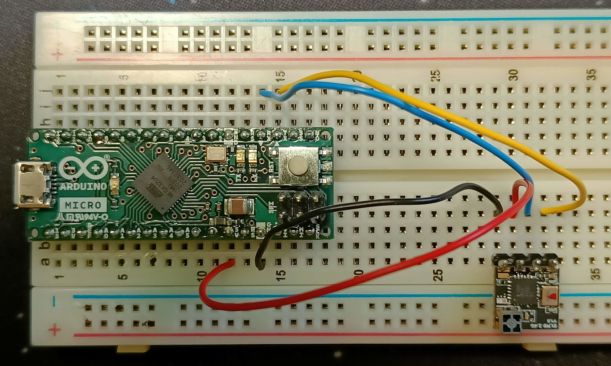

# Awareness Aquired

ELRS on my transmitter support BLE Joystick (but I haven't seen it!). So this is useless for me :smile:

# ELRS -> USBJoystick Bridge

## Components
* Arduino Micro
* Betaflight Lite RX
    * Header Pin
* breadboard
* some cables
* welder

## HOWTO

Weld the header pins to receiver (if needed).

Put all on breadboard and put wiring:
| Arduino | Receiver |
|--------:|:---------|
| vcc 5v  | vcc 5v   |
| GND     | GND      |
| TX      | RX       |
| RX      | TX       |

Update ELRS to latest version (in my case 3.2.0) on receiver and transmitter. Set **RCVR_UART_BAUD** to **115200**.

> **Warning** set Packet Rate to 250Hz (or 333Hz should works too) this setting make me some headache (ref: [Elrs doc - Serial Baud Rate](https://www.expresslrs.org/quick-start/transmitters/tx-prep/?h=baud#serial-baud-rate))

Compile and flash `ElrsJoystic.ino` on Arduino Micro, have fun.

### Channel mapping
| RF Channel | Joystick       |
|:-------:|:-----------------:|
| 1       | Axis X            |
| 2       | Axis Y            |
| 3       | Axis Rudder       |
| 4       | Axis Throttle     |
| 5..16   | None at the moment|

## Schematics
I've done a very basic schematics and shared under `schematics` folder 

## Thanks to
[CapnBry/CRServoF](https://github.com/CapnBry/CRServoF/tree/master) for awesome CRSF Serial protocol deserializer

